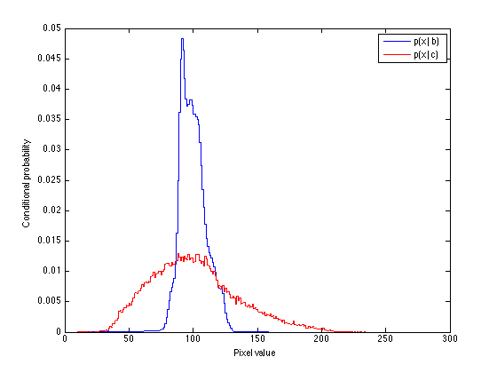
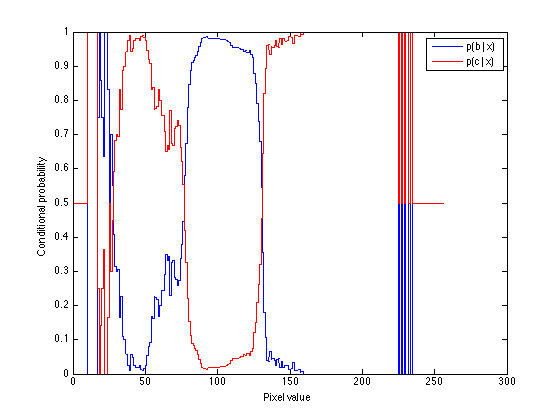
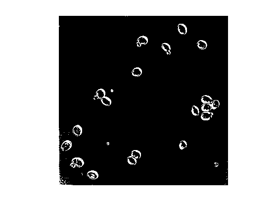

## Homework 1
\
Matt Dickenson \
CS 527 \
Fall 2014

### Problem 1

We can find $\mathbb{E}(|X-m|)$ by:

\begin{eqnarray*}
X &\sim& Unif(0,1) \\
m &=& \mathbb{E}(X) = 0.5 \\
\mathbb{E}(|X-m|) &=& \mathbb{E}(|X-0.5|) \\
&=& -E(X_{x \leq 0.5}-0.5) + E(X_{x > 0.5}-0.5) \\
&=& -(-0.25) + 0.25 \\
&=& 0.5
\end{eqnarray*}

### Problem 2

By Bayes' Theorem, we can compute the posterior probability that coin 2 was chosen by:

\begin{eqnarray*}
P(c=2 | h=1) &=& {P(h=1 | c=2) P(c=2) \over P(h=1)} \\
&=& {P(h=1 | c=2) P(c=2)} \over {P(h=1 | c=2) P(c=2) + {P(h=1 | c=1) P(c=1)}} \\
&=& {0.8 \times 0.5} \over {0.8 \times 0.5 + 0.5 \times 0.5} \\
&=& 0.4 \over 0.65 \\
&\approx& 0.615
\end{eqnarray*}

### Problem 3

Given Equation 2.3 and the fact that $x$ and $y$ are independent, we can show that $Pr(x|y=y^*)=Pr(x)$ by:

\begin{eqnarray*}
Pr(x|y=y^*) &=& {Pr(x,y=y^*) \over \int Pr(x,y=y^*) dx} \\
&=& {Pr(x,y=y^*) \over Pr(y=y^*)} \\
&=& {Pr(x) \cdot Pr(y=y^*) } \over Pr(y=y^*) \\
&=& Pr(x)
\end{eqnarray*}

### Problem 4

The expected value of one roll of this biased die, $x$, is:

\begin{eqnarray*}
\mathbb{E}(x) &=& 1 \cdot \frac{1}{12} + 2 \cdot \frac{1}{12} 
                + 3 \cdot \frac{1}{12} + 4 \cdot \frac{1}{12} 
                + 5 \cdot \frac{1}{6} + 6 \cdot \frac{1}{12} \\
            &=& \frac{10}{12} + \frac{5}{6} + \frac{6}{2} \\
            &=& \frac{56}{12} \\
            &=& \frac{14}{3} \\
            &\approx& 4.67
\end{eqnarray*}

The expected value of the sum of two rolls is:

\begin{eqnarray*}
\mathbb{E}(2x) &=& 2 \mathbb{E}(x) \\
            &=& 2 (\frac{14}{3}) \\
            &=& \frac{28}{3} \\
            &\approx& 9.34
\end{eqnarray*}

### Problem 5

Using the relations given in Exercise 2.9, we can show that $\mathbb{E}[(x-\mu)^2] = \mathbb{E}[x^2]-E[x]E[x]$ by:

\begin{eqnarray*}
\mathbb{E}[(x-\mu)^2] &=& \mathbb{E}[x^2 - 2x \mu + \mu^2 ] \\
    &=& \mathbb{E}[x^2] - \mathbb{E}[2x \mu] + \mathbb{E}[\mu^2] \\
    &=& \mathbb{E}[x^2] - 2\mathbb{E}[x \mu] + \mathbb{E}[x]\mathbb{E}[x] \\
    &=& \mathbb{E}[x^2] - 2\mathbb{E}[x]\mathbb{E}[x] + \mathbb{E}[x]\mathbb{E}[x] \\
\mathbb{E}[(x-\mu)^2] &=& \mathbb{E}[x^2]-E[x]E[x] \\
\end{eqnarray*}

### Problem 6

#### (a)

**isProbability.m**:

```
% indicate whether a given matrix P is a valid probability distribution
function valid = isProbability(P)
  if ~ismatrix(P)
      error('Input must be a matrix')
  end
  nonnegative = all(all(P >= 0));
  total = sum(sum(P, 1));
  normalized = (abs(total - 1) <= 0.0001);
  valid = nonnegative & normalized;
end
```

#### (b)

```
% check validity of some matrices
>> isProbability([0 1; 1 0])

ans =

     0

>> isProbability([0 -0.2; 0.7 0.5])

ans =

     0

>> isProbability([1 2 1; 3 0 1] / 8)

ans =

     1

```

#### (c)

**marginals.m**:

```
% compute marginal distributions from a joint probability distribution
function [Px, Py] = marginals(P)
  if ~isProbability(P)
      error('Input must be a valid probability matrix')
  end
  Px = sum(P, 2);
  Py = sum(P, 1);
end
```

#### (d)

```
>> P = [0 1 2 1; 0 9 0 3] / 16;
>> [Px, Py] = marginals(P)

Px =

    0.2500
    0.7500


Py =

         0    0.6250    0.1250    0.2500
```

#### (e)

**conditionals.m**:

```
% compute two conditional probability distributions from a joint
% probability distribution
function [Pxgy, Pygx] = conditionals(P)
  [Px, Py] = marginals(P);
  Pxgy = conditional(P, Py);
  Pygx = transpose(conditional(transpose(P), transpose(Px)));
end

function Pxgy = conditional(Pxy, Py)
  [nrows, ncols] = size(Pxy);
  Pxgy = Pxy ./ (ones(nrows, 1) * Py);
  Pxgy(isnan(Pxgy)) = 1/nrows; % replace NAs (from dividing by zero)
end
```

#### (f)

```
>> [Pxgy, Pygx] = conditionals(P)

Pxgy =

    0.5000    0.3333    0.7500
    0.5000    0.6667    0.2500


Pygx =

         0    0.4000    0.6000
         0    0.8000    0.2000
```

#### (g)

**bayes.m**:

```
function Pygx = bayes(Pxgy, Py)
  [nrow, ncol] = size(Pxgy)
  
  % check validity
  if ~(isProbability(Py) & isProbability(Pxgy/ncol))
      error('Input must be a valid probability matrix')
  end
  
  numer = Pxgy * diag(Py)
  denom = Pxgy * transpose(Py)
  Pygx = numer ./ (denom * ones(1, ncol))
    
  Pygx(isnan(Pygx)) = 1/ncol; % replace NaNs from divide-by-zero
end
```
#### (h)

```
>> bayes(Pxgy, Py)

ans =

         0    0.4000    0.6000
         0    0.8000    0.2000
```

#### (i)

```
>> transpose(bayes(transpose(Pygx), transpose(Px)))

ans =

    0.5000    0.3333    0.7500
    0.5000    0.6667    0.2500
```


### Problem 7

#### (a)

\begin{eqnarray*}
p(c) &=& 58,299 / 1024^2 \\
     &=& 58,299 / 1,048,576 \\
     &\approx& 0.0556 \\
p(b) &=& 1 - p(c) \\
     &\approx& 0.9444
\end{eqnarray*}


#### (b)

See Figure 1 below.



#### (c)

```
pc = 58299 / (1024 ^ 2)
pb = 1 - pc

Pxgy = transpose([transpose(pxgb); transpose(pxgc)])
Py = [pb pc];
Pygx = bayes(Pxgy, Py)
```

See Figure 2 below.



#### (d)

For any given value of $x$, the only possibilities are $y=c$ or $y=b$, so $p(c|x)+p(b|x)=1 \forall x$.

#### (e)

The most natural value of $\tau$ in this scenario is $p(c|x) > 0.5$. With $\tau=0.5$, we are classifying pixels as cells if there is a greater than 0.5 probability that they are cells. Since there are only two possibilities in this case (cell or background), this means pixels that are more likely to be cells than background are classified as cells.

todo: since the population value is known, set it at the value such that the number of pixels classified as cells == p(c)

#### (f)

See Figure 3 below.




#### (g)

The classifier identifies dark pixels in the yeast image as "cells." In particular, it identifies cell walls pretty well. However, it also misclassifies some other dark spots that appear to be blemishes on the image (such as in the bottom-left quadrant of the yeast image). This is a good start, but it is not completely satisfactory. It would be difficult to get substantially better results based on pixel values alone. Edge detection would likely be a helpful addition for this problem, since all pixels within the edges of a cell should also be classified as belonging to the cell. 


#### (h)

The Bayes classifier has the advantage of relying on the probability that a pixel belongs to the cell (or background) rather than relying on a single threshold. For $X = {0, . . . , 255}$, a single threshold can deal with 257 possible subsets (the empty set and any cut-off from 0 to 255). A probabilistic classifier relying on a probability threshold $p(c|x)$, on the other hand, has $2^{256}$ possible subsets. By having exponentially more flexibility, the Bayes classifier can deal with more complex classification problems. 

