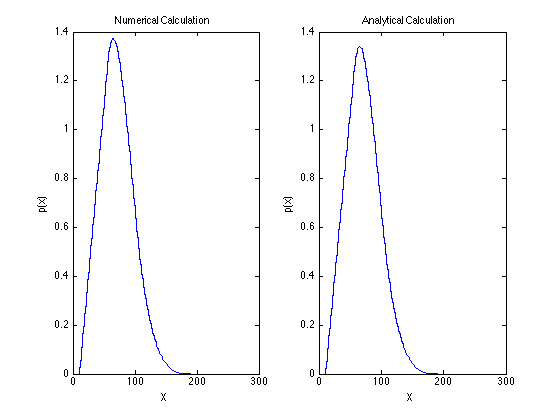
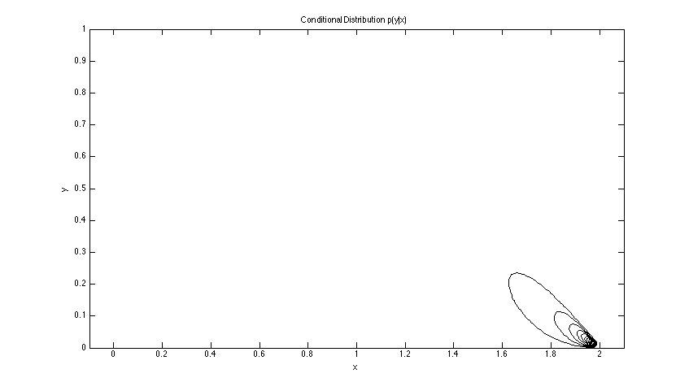
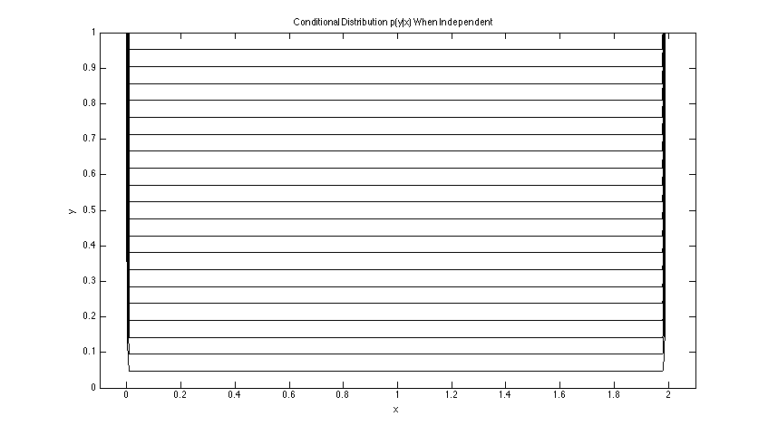
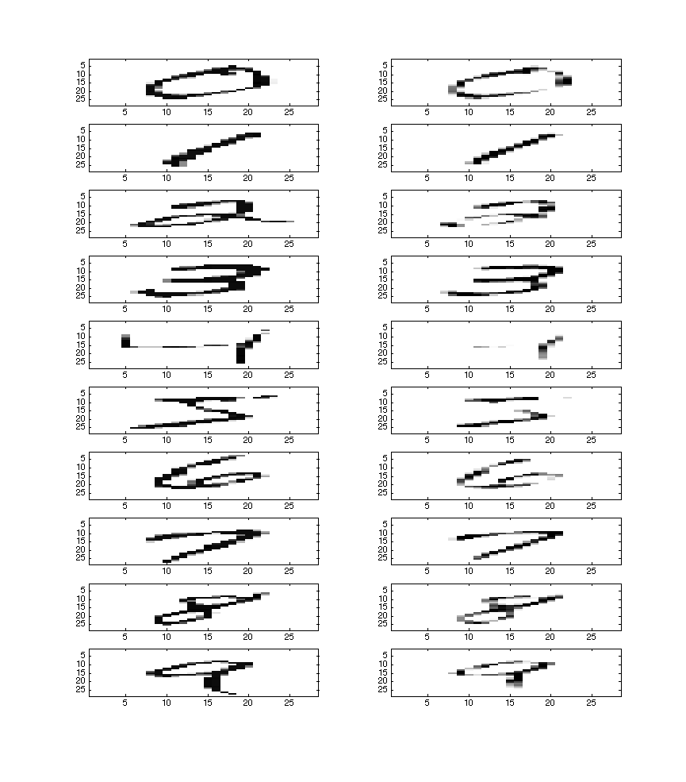
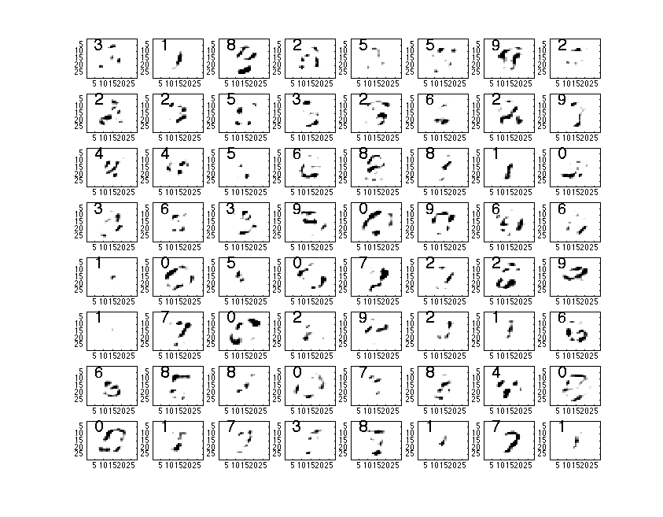

## Homework 1
\
Matt Dickenson \
CS 527 \
Fall 2014

### Problem 1


#### (a)

**integrate.m**:

```
function i = integrate(p, dx, dy)
  if nargin < 2
    error('dx and/or dy must be specified')
  end
  
  if isvector(p)
    if (nargin == 3 && ~isempty(dy))
      error('dy is specified but p is one-dimensional')
    end
    total = p(1) + p(end) + sum(p(2:end-1))*2;
    i = dx/2 * total;
    return
  end
  
  if ~isvector(p) && (nargin == 2 || isempty(dy))
    total = p(: , 1) + p(:, end) + sum(p(:, 1:end), 2)*2;
    i = dx/2 * total;
    return % returns a column vector
  end
  
  if isempty(dx) && ~isempty(dy)
    i = transpose(integrate(transpose(p), dy));
    return % returns a row vector
  end
  
  if nargin==3 
    % use Fubini's thm
    i = integrate( integrate(p, dx),  dy);
    return % returns a scalar
  end

end
```

The marginal distribution $p(x)$, computed both analytically and numerically, is shown in Figure 1 below.




#### (b)

The root-mean-square discrepancy between the numerical and the analytical calcuations is 0.0155.


#### (c)

```
x = linspace(-0.1, 2.1, 201);
y = linspace(0, 1, 101);
P = pXYa(x, y)
dy = 0.01
pxn = integrate(P, [], dy)

[nrows, ncols] = size(P)
pygxn = P ./ (ones(nrows, 1) * pxn) 
pygxn(isnan(pygxn)) = 0
contour(x, y, pygxn, 20, 'Color', 'k')
```



#### (d)

Figure 2 above shows that $X$ and $Y$ are not independent because the probability of low values of $Y$ is highly concentrated on the area where $1.6 < X < 2$. If the two variables were independent, the contours in the $x$ direction would be horizontal lines, indicating that values of $x$ do not give us information about the probability of $y$ values.

#### (e)

To compute samples of a joint probability distribution $p^\prime (x, y)$ with the same marginals as above, I computed the marginals and multiplied them together. This is consistent with the independence assumption. The code snippet and contour plot are shown below.

```
pxn = integrate(pxya, [], dy)
pyn = integrate(pxya, dx)
pxy_indep = pyn * pxn

ppygx = pxy_indep ./ (ones(nrows, 1) * pxn)
ppygx(isnan(ppygx)) = 0
contour(x, y, ppygx, 20, 'Color', 'k')
xlabel('x')
ylabel('y')
title('Conditional Distribution p(y|x) When Independent')
```




#### (f)

If there are $m+1$ samples in each of $x$ and $y$, calculating the two-dimensional integral using Fubini's theorem and the trapezoidal rule takes $m^2$ sums.

#### (g)

In general, computing a $d$-dimensional integral using Fubini's theorem and the trapezoidal rule takes $m^d$ steps for $m+1$ samples.

#### (h)

Since the complexity is exponential, using Fubini's theorem and the trapezoidal rule to compute high-dimensional integrals is very time consuming. 

### Problem 2

#### (a)

The vectors in `cimg` are 12.25 ($28^2 \over 64$) times shorter than the original images strung into vectors.

#### (b)

A pair of images (original on the left, reconstructed on the right) is shown for each digit below.



#### (c)

**normalModel.m**

```
function [likelihood, prior] = normalModel(X, L)
  X = double(X);
  [d, n] = size(X)
  labels = unique(L);
  l = size(labels, 2)
  m = zeros(d, l);
  s = zeros(d, l);
  prior = zeros(l, 1);
  size(prior)
  for i=1:l
    x = X(:, L==labels(i));
    k = size(x, 2);
    m(:, i) = mean(transpose(x));
    s(:, i) = std(transpose(x)).^2;
    prior(i, :) = k/n
  end
  likelihood = struct('M', m, 'S', s)
end
```

#### (d)

The figure below shows samples drawn at random from the generative model, along with their labels.



#### (e)

**normalValue.m**

```
function [v, delta]  = normalValue(X, m, s)
  [d, n] = size(X)
  mu = m * ones(1, n);
  diffsq = (X - mu).^2;
  quot = diffsq ./ (s * ones(1,n));
  delta = sqrt(sum(quot, 1));
  Sigma = diag(s);
  v = mvnpdf(transpose(X), transpose(m), Sigma);
end
```

#### (f)

**distances.m**

```
function D = distances(L)
  [l, d] = size(L.M);
  D = zeros(l);
  for i = 1:l
    for j = 1:l
      s = diag( L.S(j, :) );
      D(i, j) = mahal( L.M(i, :), L.M(j, :),  s) ;
    end
  end
end

function m = mahal(mu1, mu2, s2)
  m = sqrt( sum(( (mu1-mu2).^2 ) / s2 ));
end
```

The values for D are appended at the end of this submission.

#### (g)

**classify.m**

```
function label = classify(img, likelihood, prior)
  compressed = code(img);
  n = size(compressed, 2);
  d = size(likelihood.M, 2);
  post = zeros(d, n);
  for i=1:d
    [v, delta] = normalValue(compressed, likelihood.M(:, i), likelihood.S(:, i));
    post(i, :) = v * prior(i);
  end
  label = zeros(1, n);
  for j=1:n
    col = post(:, j);
    argmax = find( col == max(col));
    label(j) = argmax-1;
  end
end
```

#### (h)

**errorStats.m**

```
function [E, errorRate, pCgT] = errorStats(computedLabel, trueLabel)
  labels = unique(computedLabel);
  n = size(computedLabel, 2);
  l = size(labels, 2);
  E = zeros(l, l);
  pCgT = zeros(l, l);
  for i=1:l
    for j=1:l
      E(i, j) = sum( (trueLabel == i-1) & (computedLabel == j-1) );
      pCgT(i, j) = sum((computedLabel==i-1) & (trueLabel==j-1))/sum(trueLabel==j-1);
    end
  end
  errorRate = 1 - (sum(diag(E))/n);
end
```

**Output:**

The error rate is 12.3\%.

```
E =

  Columns 1 through 7

         928           0           9           3           1          21          12
           0        1074          13           9           1          11           6
          19           1         884          32          13           6          11
           4           1          19         877           2          50           3
           1           2          19           0         851          10          14
           4           1          11          67           8         743          12
          13           3          14           3          12          40         870
           3          22          40           2          17          15           5
           5           0          16          34           9          43           2
          13           2          28           9          69          13           1

  Columns 8 through 10

           2           3           1
           1          20           0
          16          46           4
          15          27          12
           3           7          75
           9          33           4
           0           2           1
         859          16          49
           8         845          12
          23          10         841

errorRate =

    0.1228

pCgT = 

  Columns 1 through 8

    0.947        0    0.018    0.004    0.001    0.004    0.014    0.003
    0        0.946    0.001    0.001    0.002    0.001    0.003    0.021
    0.009    0.011    0.857    0.019    0.019    0.012    0.015    0.039
    0.003    0.008    0.031    0.868        0    0.075    0.003    0.002
    0.001    0.001    0.013    0.002    0.867    0.009    0.013    0.017
    0.021    0.010    0.006    0.050    0.010    0.833    0.042    0.015
    0.012    0.005    0.011    0.003    0.014    0.013    0.908    0.005
    0.002    0.001    0.016    0.015    0.003    0.010        0    0.836
    0.003    0.018    0.045    0.027    0.007    0.037    0.002    0.016
    0.001        0    0.004    0.012    0.076    0.004    0.001    0.048

  Columns 9 through 10

    0.005    0.013
        0    0.002
    0.016    0.028
    0.035    0.009
    0.009    0.068
    0.044    0.013
    0.002    0.001
    0.008    0.023
    0.868    0.010
    0.012    0.833
```

#### (i)

Given the instructions, column `j` in `pCgT` indicates values where the true digit was `j-1`. Thus, each column of `pCgT` should sum to one, as they do.

#### (j)

If the classifier's error rate is $p$ and errors on different digits are independent, the probability that the classifier gets a five-digit zip code wrong is $p_Z = 1 - (1 - p^5)$. For my error rate, $p=0.123$, $p_Z = 1 - (1-0.123)^5 = 0.481$. For the best available rate today, $p=0.002$, $p_Z = 1 - (1 - 0.002)^5 \approx 0.001$.

#### (k)

If the state-of-the-art digit classifier were used, approximately 3,984,032 zip codes would be misclassified in the US each day.

#### (l)

The posterior $p(\hat{w}|x)$ can take on values between 0.1 and 1. Because $\hat{w}$ is the argmax of a variable with 10 possible values, it must be at least 0.1. Because it is a probability, its upper bound is 1.

#### (m)

An automatic zip code scanner could use the posterior value to determine whether there is sufficient confidence int he automated classification, or if the zip code needs further review (eg by a human). Some threshold, such as $\prod_{i=1}^5 p(\hat{w}_i|x_i) < 0.9$, could be chosen so that misclassifications by the automated system are kept to a minimum while still saving the time of human reviewers. 

#### (n)

The assumption that errors on adjacent digits are mutually independent is not valid. First, all five digits in a handwritten zip code are typically generated by the same human hand. If a person has bad handwriting (1's that can easily be mistaken for 7's, for example), then errors will be correlated across digits they write. Secondly, it's possible that one digit will overlap or be smeared with a subsequent digit, making them both difficult to classify.


\clearpage

```
D = 
  Columns 1 through 8

         0    7.18    4.86    7.19    5.26    4.35    4.93    7.52
    5.72         0    3.49    5.65    5.46    4.48    5.46    6.06
    6.05    4.53         0    4.53    3.30    2.88    3.57    3.83
    7.24    5.26    3.81         0    4.39    3.59    3.75    3.80
    8.01    6.00    2.86    4.35         0    3.56    3.32    3.62
    6.86    4.80    2.13    3.62    3.35         0    3.26    3.35
    6.95    5.05    2.48    3.06    2.82    2.32         0    3.15
    7.26    5.04    2.64    3.08    3.08    2.88    3.03         0
    5.77    4.52    1.78    2.80    2.99    1.81    1.96    2.69
    6.02    4.17    1.49    3.08    2.84    2.58    2.53    2.66
    6.50    4.72    1.73    2.70    2.88    1.94    2.39    2.06
    6.72    4.52    1.83    2.58    2.99    2.30    2.98    2.23
    6.98    4.63    1.88    2.85    2.58    2.39    2.05    1.89
    6.32    4.62    1.85    3.05    2.89    2.12    2.13    1.90
    5.38    4.31    1.61    3.16    2.93    2.35    2.29    2.98
    5.93    4.42    1.76    2.88    2.77    2.35    2.69    2.24
    5.92    4.26    1.86    2.77    2.74    2.43    2.08    2.13
    6.72    4.23    1.76    2.67    2.72    2.04    2.34    1.84
    6.31    4.32    1.66    2.64    2.63    2.02    2.11    2.45
    6.61    4.58    1.67    2.81    2.67    1.87    2.26    2.06
    6.33    4.39    1.64    2.73    2.73    2.06    2.12    2.11
    6.41    4.37    1.66    2.78    2.52    1.97    2.16    2.13
    5.76    4.19    1.56    3.01    2.91    2.14    2.33    2.30
    6.23    4.25    1.61    2.81    2.66    1.92    2.24    2.14
    6.37    4.47    1.64    2.77    2.65    1.96    2.09    2.06
    6.53    4.42    1.77    2.74    2.43    2.18    2.18    2.04
    6.03    4.29    1.67    2.82    2.73    1.98    1.95    2.24
    6.05    4.32    1.60    2.83    2.75    1.91    2.25    2.14
    6.41    4.45    1.70    2.74    2.63    2.00    2.10    1.94
    6.27    4.43    1.68    2.77    2.64    2.12    2.21    1.94
    6.26    4.42    1.70    2.70    2.64    2.03    1.84    2.25
    6.31    4.27    1.63    2.80    2.65    2.09    2.27    1.95
    6.39    4.45    1.75    2.70    2.55    2.03    2.02    2.01
    6.18    4.33    1.61    2.81    2.68    1.99    2.04    2.17
    6.37    4.34    1.67    2.78    2.67    2.09    2.21    1.91
    6.28    4.33    1.66    2.73    2.66    2.07    2.06    2.11
    6.23    4.40    1.67    2.75    2.64    2.02    2.03    2.09
    6.37    4.37    1.72    2.67    2.60    2.01    2.07    2.03
    6.36    4.42    1.69    2.74    2.62    2.11    2.16    2.01
    6.23    4.36    1.65    2.77    2.65    2.01    2.21    2.09
    6.30    4.33    1.62    2.75    2.69    2.06    2.23    2.08
    6.42    4.44    1.69    2.76    2.57    2.13    2.14    1.95
    6.42    4.44    1.71    2.72    2.59    1.99    2.08    1.98
    6.32    4.34    1.69    2.70    2.63    2.11    2.15    2.04
    6.14    4.35    1.65    2.76    2.67    2.09    2.07    2.15
    6.25    4.36    1.66    2.73    2.65    2.06    2.17    2.10
    6.23    4.31    1.63    2.77    2.68    2.00    2.06    2.11
    6.39    4.38    1.69    2.71    2.59    2.04    2.13    1.99
    6.35    4.40    1.68    2.72    2.62    2.01    2.17    2.
    6.27    4.31    1.69    2.69    2.64    2.08    2.13    2.08
    6.39    4.44    1.71    2.69    2.61    2.10    2.07    2.05
    6.31    4.37    1.69    2.71    2.62    2.04    2.10    2.04
    6.31    4.37    1.68    2.72    2.61    2.12    2.20    2.02
    6.26    4.32    1.64    2.74    2.63    2.00    2.22    2.12
    6.30    4.34    1.64    2.75    2.64    1.99    2.14    2.06
    6.34    4.37    1.65    2.72    2.60    2.03    2.17    2.09
    6.42    4.39    1.69    2.71    2.59    2.08    2.16    1.99
    6.33    4.38    1.64    2.77    2.61    1.98    2.19    2.00
    6.34    4.39    1.68    2.71    2.62    2.02    2.14    2.02
    6.34    4.37    1.68    2.70    2.63    2.06    2.19    2.02
    6.33    4.37    1.65    2.73    2.61    2.04    2.20    2.08
    6.30    4.36    1.66    2.72    2.64    2.05    2.16    2.08
    6.31    4.38    1.69    2.72    2.63    2.06    2.11    2.03
    6.34    4.35    1.67    2.71    2.61    2.02    2.13    2.08

  Columns 9 through 16

    4.31    8.17    5.52    5.54    8.42    6.43    5.41    8.90
    4.64    4.42    5.44    5.46    6.32    6.14    5.83    6.84
    2.33    2.20    2.42    2.71    3.11    3.63    3.16    3.25
    2.97    3.81    3.39    3.40    4.00    4.19    4.90    4.04
    3.09    4.63    3.78    3.69    3.73    4.28    4.27    4.94
    2.11    3.43    2.54    2.94    3.50    3.12    3.91    3.17
    1.86    2.39    2.61    2.99    2.35    2.38    2.85    3.44
    2.12    2.74    1.98    2.44    2.20    2.13    3.31    2.77
       0    1.49    0.80    1.62    1.87    1.34    1.09    1.25
    1.18       0    1.23    1.31    1.41    1.67    1.56    1.37
    0.72    1.41       0    1.08    1.25    1.27    1.47    1.25
    1.41    1.37    1.03       0    1.55    1.97    2.02    1.81
    1.13    1.26    0.99    1.39       0    1.17    1.81    1.84
    0.97    1.40    1.14    1.88    1.31       0    2.12    1.30
    0.74    1.40    1.14    1.76    2.24    1.78       0    1.47
    0.90    1.22    0.95    1.47    1.66    1.23    1.28       0
    0.95    1.10    1.15    1.52    1.44    1.41    1.27    1.31
    1.01    1.25    0.84    1.00    0.93    1.40    1.66    1.54
    0.72    1.03    0.92    1.06    1.22    1.47    1.33    1.18
    1.06    1.66    0.99    1.08    1.41    1.83    1.74    1.91
    0.81    1.13    0.76    1.07    1.16    1.52    1.24    1.47
    0.69    1.28    0.77    1.29    1.18    1.28    1.17    1.10
    0.84    0.94    0.93    1.22    1.57    1.17    1.43    1.11
    0.76    1.11    0.84    1.09    1.23    1.18    1.44    1.05
    0.63    1.15    0.57    1.13    1.03    1.15    1.24    1.16
    0.92    1.14    0.96    1.13    0.87    1.16    1.54    1.18
    0.63    1.04    0.94    1.32    1.29    1.04    1.32    1.12
    0.64    1.22    0.67    1.15    1.43    1.24    1.21    1.01
    0.70    1.24    0.62    1.21    1.05    1.20    1.23    1.24
    0.77    1.10    0.68    1.07    1.06    1.13    1.29    1.04
    0.70    1.08    0.93    1.21    1.10    1.30    1.35    1.36
    0.85    1.08    0.77    1.06    1.10    1.29    1.33    1.16
    0.69    1.16    0.75    1.17    0.96    1.07    1.31    1.11
    0.75    1.07    0.90    1.13    1.18    1.28    1.38    1.28
    0.89    1.09    0.81    1.01    1.00    1.23    1.51    1.28
    0.76    1.00    0.83    1.07    1.05    1.26    1.32    1.23
    0.66    1.10    0.75    1.15    1.10    1.15    1.24    1.13
    0.78    1.20    0.84    1.06    1.07    1.29    1.40    1.28
    0.73    0.99    0.66    1.08    0.92    1.04    1.30    1.
    0.67    1.05    0.66    1.08    1.14    1.10    1.24    0.91
    0.76    0.99    0.66    0.96    1.07    1.28    1.27    1.13
    0.78    1.06    0.68    1.08    0.88    1.12    1.30    1.13
    0.78    1.22    0.79    1.05    1.01    1.21    1.45    1.27
    0.79    1.03    0.78    1.01    1.02    1.26    1.32    1.17
    0.66    1.01    0.74    1.16    1.18    1.25    1.08    1.11
    0.71    1.01    0.71    1.01    1.09    1.19    1.27    1.03
    0.72    1.03    0.81    1.12    1.11    1.21    1.31    1.20
    0.78    1.16    0.76    1.03    1.02    1.25    1.36    1.22
    0.73    1.15    0.67    1.02    1.05    1.19    1.32    1.11
    0.71    1.04    0.75    1.08    1.09    1.24    1.20    1.08
    0.74    1.04    0.72    1.04    0.91    1.18    1.32    1.19
    0.72    1.10    0.75    1.07    1.04    1.18    1.30    1.12
    0.78    1.05    0.73    1.01    1.03    1.23    1.27    1.08
    0.71    1.09    0.71    1.02    1.17    1.24    1.25    1.
    0.72    1.11    0.72    1.07    1.11    1.26    1.27    1.17
    0.74    1.09    0.73    1.00    1.05    1.25    1.31    1.12
    0.80    1.10    0.72    0.99    0.95    1.24    1.34    1.19
    0.75    1.19    0.70    1.05    1.12    1.25    1.31    1.16
    0.73    1.14    0.70    1.04    1.05    1.22    1.29    1.15
    0.77    1.10    0.72    0.98    1.05    1.25    1.33    1.14
    0.73    1.07    0.67    0.99    1.06    1.24    1.26    1.07
    0.71    1.04    0.69    1.02    1.06    1.22    1.25    1.08
    0.74    1.06    0.75    1.06    1.01    1.15    1.34    1.12
    0.74    1.09    0.75    1.02    1.06    1.27    1.31    1.17

  Columns 17 through 24

    7.60    8.54   11.42    8.57   11.23   10.40   10.33    9.40
    6.40    6.93    8.00    7.05    7.29    7.77    7.51    7.37
    3.29    3.07    3.20    3.54    3.40    3.77    3.46    3.77
    4.22    3.99    4.30    5.04    4.61    4.92    5.39    5.
    4.57    4.58    5.12    4.57    5.61    4.80    6.03    5.20
    3.64    2.87    3.18    3.16    3.53    3.26    4.17    3.39
    2.82    3.25    3.21    2.85    2.97    3.12    3.79    3.13
    2.75    2.36    3.62    2.92    2.90    3.06    3.60    3.15
    1.42    1.72    1.48    1.81    1.46    1.37    1.42    1.38
    1.41    1.48    1.26    2.11    1.57    1.77    1.23    1.50
    1.53    1.12    1.31    1.26    1.00    0.98    1.75    1.22
    2.01    1.27    1.80    1.39    1.47    1.90    2.21    1.60
    1.54    1.15    1.62    1.79    1.52    1.46    2.28    1.54
    1.67    1.77    1.84    2.07    1.51    1.36    1.59    1.48
    1.31    1.94    2.07    2.02    1.99    1.87    1.75    1.80
    1.30    1.61    1.41    1.91    1.67    1.27    1.42    1.27
       0    1.31    1.36    1.70    1.15    1.35    1.17    1.28
    1.29       0    1.11    1.09    0.85    0.99    1.76    0.90
    1.24    1.02       0    1.25    0.83    0.88    1.35    0.73
    1.53    1.06    1.37       0    0.92    1.32    1.99    1.23
    0.94    0.82    0.90    0.78       0    0.88    1.33    0.89
    1.11    0.88    0.75    1.15    0.85       0    1.56    0.76
    1.00    1.21    1.39    1.52    1.19    1.44       0    0.82
    1.09    0.82    0.66    1.10    0.80    0.80    1.00       0
    1.03    0.83    0.77    0.97    0.51    0.53    1.31    0.61
    1.23    1.02    0.80    1.37    1.08    0.90    1.57    0.69
    0.84    1.10    0.88    1.33    0.91    1.00    0.77    0.55
    0.94    0.93    0.97    1.02    0.70    0.77    0.90    0.54
    0.95    0.80    0.94    0.95    0.51    0.48    1.44    0.75
    0.85    0.81    0.88    1.05    0.60    0.73    1.09    0.55
    0.94    1.01    0.61    1.10    0.66    0.97    1.20    0.70
    0.88    0.59    0.84    0.97    0.51    0.70    1.12    0.53
    0.95    0.89    0.70    1.12    0.70    0.58    1.33    0.53
    0.92    0.87    0.71    0.98    0.63    0.96    0.94    0.48
    0.98    0.60    0.89    0.98    0.58    0.92    1.16    0.54
    0.85    0.74    0.63    1.02    0.48    0.82    1.07    0.51
    0.83    0.88    0.72    1.03    0.53    0.70    1.05    0.48
    0.96    0.71    0.68    0.89    0.56    0.77    1.28    0.50
    0.95    0.82    0.70    1.20    0.68    0.65    1.20    0.53
    0.95    0.84    0.68    1.12    0.67    0.60    1.03    0.36
    0.94    0.63    0.67    0.97    0.43    0.71    1.10    0.50
    0.94    0.75    0.79    1.07    0.61    0.63    1.32    0.58
    1.04    0.75    0.76    0.88    0.63    0.79    1.32    0.47
    0.87    0.68    0.66    1.02    0.50    0.77    1.14    0.50
    0.70    0.90    0.76    1.09    0.50    0.72    0.98    0.63
    0.91    0.78    0.61    1.07    0.57    0.72    1.02    0.39
    0.86    0.77    0.67    1.01    0.51    0.79    0.98    0.43
    0.95    0.66    0.71    0.90    0.52    0.69    1.28    0.47
    0.97    0.71    0.72    0.94    0.53    0.63    1.22    0.43
    0.80    0.73    0.61    1.07    0.50    0.62    1.11    0.51
    0.94    0.78    0.66    1.05    0.55    0.75    1.27    0.57
    0.89    0.75    0.65    1.00    0.53    0.67    1.14    0.42
    0.87    0.72    0.69    1.02    0.55    0.68    1.16    0.50
    0.98    0.76    0.58    1.01    0.60    0.61    1.09    0.32
    0.91    0.69    0.68    0.90    0.42    0.61    1.15    0.45
    0.99    0.72    0.57    0.96    0.55    0.65    1.21    0.39
    0.97    0.64    0.71    0.95    0.52    0.68    1.32    0.52
    0.97    0.70    0.76    0.84    0.49    0.60    1.22    0.45
    0.93    0.71    0.70    0.92    0.48    0.63    1.22    0.46
    0.94    0.68    0.69    0.94    0.51    0.72    1.18    0.45
    0.98    0.71    0.60    0.97    0.53    0.61    1.19    0.42
    0.91    0.72    0.61    1.00    0.48    0.65    1.12    0.44
    0.89    0.75    0.67    1.05    0.56    0.74    1.11    0.43
    0.96    0.69    0.58    0.94    0.50    0.67    1.20    0.42

  Columns 25 through 32

   12.76    9.40    8.85    8.10   14.00    9.90   10.85   10.79
    8.51    9.03    7.75    7.81    9.93    8.72    9.56    8.34
    3.62    4.04    4.09    3.93    4.33    4.38    4.27    4.52
    5.10    4.86    5.40    5.44    5.48    5.71    5.64    5.98
    5.91    4.77    5.49    5.27    6.07    5.70    6.11    6.07
    3.55    3.66    4.13    3.77    3.78    4.42    4.15    4.43
    3.26    3.73    3.11    3.67    3.52    3.88    3.52    3.79
    3.21    3.37    3.30    2.98    3.40    3.19    3.83    3.30
    1.49    1.84    1.21    1.19    1.85    1.54    1.62    1.66
    1.71    1.48    1.53    1.81    2.08    1.74    1.84    1.82
    0.82    1.44    1.47    1.03    0.99    1.15    1.55    1.31
    1.84    1.84    2.12    1.77    2.07    1.86    2.32    1.74
    1.50    1.19    1.50    1.66    1.64    1.50    1.66    1.63
    1.37    1.87    1.35    1.60    1.68    1.60    1.93    1.81
    2.22    2.36    1.63    1.54    2.64    1.85    1.94    2.04
    1.41    1.55    1.50    1.44    1.81    1.30    1.91    1.67
    1.38    1.61    1.10    1.26    1.46    1.14    1.23    1.28
    0.96    1.20    1.17    0.97    1.03    0.96    1.30    0.79
    0.78    0.86    0.85    0.99    1.14    1.04    0.79    1.08
    1.13    1.80    1.57    1.14    1.27    1.27    1.43    1.29
    0.53    1.48    1.00    0.73    0.66    0.71    0.88    0.67
    0.51    0.99    1.00    0.74    0.57    0.89    1.00    0.84
    1.41    1.43    0.73    0.85    1.73    0.94    1.25    1.03
    0.69    0.79    0.61    0.60    0.94    0.67    0.85    0.64
       0    0.99    0.74    0.53    0.37    0.54    0.69    0.62
    0.90       0    0.89    1.05    1.14    0.83    1.09    0.94
    0.88    1.06       0    0.74    1.15    0.78    0.61    0.89
    0.72    1.24    0.76       0    0.89    0.56    0.94    0.57
    0.29    1.18    0.87    0.56       0    0.55    0.85    0.57
    0.49    0.91    0.73    0.49    0.56       0    0.81    0.40
    0.64    1.05    0.52    0.90    0.89    0.81       0    0.96
    0.54    1.05    0.81    0.50    0.58    0.38    0.92       0
    0.41    0.67    0.58    0.64    0.57    0.47    0.62    0.63
    0.64    1.05    0.49    0.67    0.88    0.61    0.47    0.71
    0.62    0.98    0.77    0.67    0.71    0.43    0.87    0.43
    0.51    0.94    0.54    0.65    0.69    0.49    0.46    0.54
    0.43    0.94    0.47    0.50    0.59    0.38    0.46    0.53
    0.54    0.88    0.65    0.60    0.62    0.48    0.56    0.54
    0.40    0.65    0.65    0.67    0.63    0.40    0.75    0.59
    0.45    0.77    0.61    0.44    0.69    0.39    0.77    0.50
    0.42    0.95    0.74    0.52    0.60    0.42    0.74    0.39
    0.38    0.75    0.73    0.64    0.48    0.32    0.73    0.48
    0.51    0.80    0.67    0.60    0.63    0.44    0.61    0.58
    0.52    0.83    0.65    0.60    0.63    0.36    0.62    0.41
    0.54    1.11    0.58    0.53    0.69    0.46    0.57    0.54
    0.47    0.76    0.58    0.51    0.70    0.35    0.63    0.47
    0.50    0.99    0.46    0.56    0.70    0.49    0.48    0.52
    0.45    0.84    0.69    0.52    0.52    0.36    0.64    0.38
    0.37    0.81    0.69    0.44    0.50    0.29    0.69    0.39
    0.46    0.89    0.61    0.52    0.57    0.40    0.61    0.41
    0.42    0.74    0.64    0.69    0.61    0.43    0.53    0.60
    0.41    0.80    0.56    0.50    0.55    0.33    0.56    0.43
    0.48    0.79    0.71    0.54    0.58    0.26    0.71    0.36
    0.48    0.78    0.67    0.42    0.68    0.44    0.73    0.44
    0.34    0.98    0.66    0.40    0.48    0.40    0.62    0.34
    0.42    0.72    0.67    0.52    0.61    0.42    0.62    0.46
    0.44    0.78    0.74    0.58    0.53    0.36    0.69    0.39
    0.38    0.95    0.75    0.36    0.45    0.36    0.73    0.33
    0.36    0.86    0.67    0.45    0.47    0.31    0.62    0.38
    0.47    0.82    0.70    0.50    0.58    0.31    0.69    0.37
    0.38    0.76    0.71    0.48    0.57    0.38    0.69    0.42
    0.38    0.83    0.63    0.49    0.56    0.35    0.61    0.41
    0.45    0.77    0.54    0.56    0.61    0.32    0.57    0.47
    0.42    0.81    0.64    0.52    0.58    0.43    0.56    0.45

  Columns 33 through 40

   12.33   14.19   15.31   12.97   12.60   12.99   13.54   11.72
   10.26   10.59   11.21    9.15   10.46   10.24   10.20   10.46
    4.55    4.56    4.86    4.90    5.00    5.25    5.22    5.28
    5.81    6.37    6.50    6.48    6.64    6.53    6.78    6.86
    6.01    6.76    7.04    7.20    6.64    7.26    7.28    7.03
    4.23    4.59    5.12    5.20    4.84    4.88    5.32    5.03
    4.04    4.22    4.78    3.73    4.16    4.22    4.40    4.47
    3.65    4.34    3.78    3.86    4.13    3.89    4.05    4.13
    1.75    1.83    2.36    1.67    1.69    2.07    1.77    1.67
    1.99    1.84    2.03    1.79    2.09    2.30    1.87    2.00
    1.28    1.62    1.51    1.57    1.38    1.73    1.31    1.38
    2.37    2.47    2.19    1.99    2.43    2.19    2.18    2.21
    1.52    2.14    1.91    1.76    1.87    2.06    1.58    1.82
    1.65    1.83    1.88    1.97    1.91    2.11    1.72    1.85
    2.44    2.69    3.08    2.25    2.35    2.38    2.45    2.01
    1.67    2.06    1.99    1.95    1.83    1.94    1.70    1.49
    1.40    1.49    1.67    1.39    1.37    1.42    1.54    1.52
    1.15    1.44    0.99    1.08    1.32    1.14    1.11    1.16
    0.91    0.90    1.17    0.83    1.02    1.01    0.98    0.95
    1.52    1.55    1.42    1.51    1.51    1.29    1.79    1.73
    0.97    0.81    0.80    0.65    0.73    0.85    0.95    1.08
    0.69    1.22    1.24    1.11    0.93    1.08    0.93    0.82
    1.50    1.22    1.55    1.09    1.30    1.28    1.33    1.07
    0.75    0.62    0.81    0.70    0.74    0.66    0.80    0.52
    0.47    0.77    0.80    0.67    0.48    0.76    0.53    0.50
    0.75    1.23    1.04    0.94    1.09    0.99    0.77    0.91
    0.84    0.66    1.21    0.67    0.63    0.84    0.94    0.77
    0.90    0.80    1.04    0.85    0.68    0.78    0.92    0.60
    0.60    0.98    0.84    0.79    0.64    0.80    0.70    0.70
    0.53    0.73    0.51    0.57    0.44    0.56    0.48    0.48
    0.68    0.49    0.92    0.47    0.57    0.64    0.94    0.92
    0.72    0.72    0.42    0.57    0.63    0.60    0.62    0.65
       0    0.80    0.76    0.56    0.44    0.54    0.42    0.44
    0.72       0    0.68    0.38    0.45    0.47    0.88    0.76
    0.73    0.66       0    0.46    0.67    0.56    0.70    0.77
    0.56    0.36    0.51       0    0.36    0.41    0.60    0.63
    0.42    0.43    0.67    0.34       0    0.42    0.54    0.45
    0.49    0.58    0.46    0.40    0.47       0    0.73    0.65
    0.37    0.80    0.66    0.57    0.52    0.73       0    0.37
    0.49    0.68    0.74    0.60    0.48    0.64    0.39       0
    0.64    0.61    0.50    0.43    0.51    0.61    0.47    0.50
    0.37    0.84    0.55    0.54    0.52    0.61    0.28    0.46
    0.44    0.66    0.46    0.49    0.50    0.24    0.68    0.60
    0.52    0.57    0.38    0.24    0.45    0.36    0.48    0.54
    0.65    0.60    0.86    0.45    0.34    0.64    0.61    0.57
    0.49    0.53    0.56    0.36    0.39    0.47    0.40    0.30
    0.57    0.26    0.61    0.21    0.29    0.43    0.63    0.57
    0.44    0.65    0.40    0.39    0.45    0.22    0.55    0.52
    0.41    0.67    0.47    0.47    0.41    0.37    0.45    0.35
    0.47    0.61    0.62    0.36    0.37    0.47    0.45    0.44
    0.37    0.68    0.54    0.34    0.44    0.49    0.39    0.53
    0.36    0.53    0.48    0.31    0.28    0.30    0.44    0.39
    0.48    0.68    0.45    0.42    0.45    0.44    0.41    0.43
    0.54    0.63    0.67    0.54    0.51    0.51    0.52    0.25
    0.51    0.53    0.55    0.40    0.35    0.41    0.55    0.46
    0.44    0.61    0.52    0.41    0.47    0.38    0.47    0.37
    0.45    0.75    0.42    0.41    0.53    0.40    0.43    0.49
    0.52    0.66    0.52    0.57    0.45    0.39    0.62    0.48
    0.41    0.62    0.47    0.40    0.35    0.32    0.47    0.41
    0.50    0.63    0.39    0.38    0.45    0.32    0.49    0.46
    0.47    0.67    0.55    0.48    0.48    0.48    0.41    0.31
    0.45    0.56    0.52    0.34    0.36    0.46    0.37    0.34
    0.39    0.51    0.44    0.28    0.32    0.36    0.41    0.42
    0.45    0.54    0.49    0.31    0.41    0.30    0.51    0.45

  Columns 41 through 48

   16.28   17.20   14.92   14.95   12.14   13.92   12.57   15.83
   11.57   12.08   11.84   12.08   10.78   11.21   12.32   12.63
    5.15    5.54    5.67    5.71    5.78    5.90    5.79    5.90
    7.47    7.02    6.86    7.52    7.89    7.66    7.72    7.55
    7.73    7.48    7.33    7.70    7.62    8.21    7.51    7.94
    5.58    5.28    4.91    6.06    6.24    5.98    5.59    5.49
    4.75    4.43    4.48    5.23    4.63    4.91    5.22    5.23
    4.47    4.31    4.31    4.45    4.50    4.47    4.90    4.64
    2.27    2.50    2.29    2.21    1.71    1.79    1.97    2.50
    2.06    2.26    2.43    2.14    2.20    2.12    2.26    2.57
    1.40    1.38    1.62    1.68    1.64    1.62    1.82    1.71
    2.18    2.27    2.28    2.53    2.55    2.28    2.86    2.59
    2.20    1.82    2.00    2.01    1.95    2.03    1.96    2.13
    2.27    1.92    2.14    2.26    2.34    2.16    2.37    2.41
    3.00    3.38    3.12    2.85    2.06    2.45    2.57    3.18
    1.95    2.08    2.36    2.07    2.10    2.08    2.45    2.32
    1.85    1.84    1.83    1.68    1.39    1.72    1.63    1.79
    1.20    1.19    1.21    1.17    1.37    1.27    1.26    1.18
    0.98    1.15    1.11    1.03    1.20    0.93    1.14    1.19
    1.69    1.71    1.43    1.77    1.85    1.85    1.72    1.53
    0.75    0.97    1.01    0.86    0.74    1.01    0.91    0.89
    1.00    0.93    1.18    1.21    1.09    1.16    1.26    1.09
    1.63    1.97    1.64    1.48    1.27    1.09    1.18    1.76
    0.69    0.94    0.73    0.83    1.04    0.64    0.73    0.82
    0.60    0.54    0.71    0.76    0.65    0.66    0.70    0.69
    1.23    0.88    0.99    1.03    1.29    0.94    1.27    1.07
    1.10    1.31    1.08    1.04    0.85    0.83    0.69    1.16
    0.87    1.22    1.03    0.99    0.80    0.76    0.82    1.00
    0.77    0.63    0.87    0.87    0.69    0.89    0.92    0.78
    0.49    0.48    0.63    0.47    0.59    0.48    0.73    0.53
    0.89    0.97    0.77    0.81    0.86    0.87    0.66    0.90
    0.41    0.64    0.73    0.51    0.71    0.62    0.69    0.53
    0.74    0.43    0.55    0.61    0.65    0.52    0.72    0.54
    0.63    0.95    0.64    0.62    0.80    0.68    0.33    0.71
    0.55    0.63    0.52    0.44    0.89    0.62    0.62    0.52
    0.44    0.65    0.53    0.30    0.54    0.45    0.24    0.46
    0.54    0.65    0.54    0.49    0.39    0.40    0.36    0.53
    0.56    0.62    0.27    0.37    0.73    0.55    0.46    0.25
    0.56    0.33    0.70    0.53    0.66    0.45    0.74    0.62
    0.50    0.65    0.73    0.60    0.65    0.35    0.68    0.66
       0    0.57    0.66    0.39    0.57    0.41    0.53    0.51
    0.57       0    0.58    0.48    0.61    0.48    0.71    0.48
    0.62    0.54       0    0.48    0.81    0.54    0.52    0.29
    0.37    0.48    0.46       0    0.56    0.31    0.46    0.30
    0.64    0.86    0.88    0.63       0    0.55    0.55    0.77
    0.34    0.57    0.55    0.33    0.54       0    0.48    0.47
    0.46    0.75    0.58    0.45    0.55    0.46       0    0.54
    0.46    0.43    0.28    0.31    0.63    0.41    0.48       0
    0.38    0.40    0.38    0.39    0.61    0.31    0.55    0.25
    0.39    0.58    0.65    0.33    0.37    0.37    0.50    0.46
    0.55    0.35    0.46    0.36    0.58    0.37    0.55    0.42
    0.39    0.45    0.38    0.26    0.51    0.25    0.39    0.26
    0.35    0.39    0.53    0.23    0.53    0.30    0.61    0.34
    0.40    0.66    0.61    0.53    0.67    0.32    0.61    0.53
    0.31    0.58    0.52    0.44    0.51    0.42    0.39    0.35
    0.36    0.46    0.41    0.36    0.64    0.25    0.51    0.31
    0.45    0.31    0.40    0.30    0.61    0.35    0.57    0.22
    0.43    0.54    0.46    0.54    0.66    0.51    0.57    0.31
    0.36    0.42    0.38    0.33    0.52    0.32    0.48    0.20
    0.32    0.45    0.39    0.24    0.61    0.28    0.53    0.23
    0.30    0.44    0.52    0.40    0.60    0.27    0.59    0.38
    0.24    0.47    0.52    0.29    0.47    0.19    0.45    0.37
    0.42    0.45    0.39    0.23    0.56    0.24    0.39    0.32
    0.34    0.50    0.38    0.28    0.59    0.28    0.40    0.25

  Columns 49 through 56

   15.51   16.07   17.14   16.70   17.17   16.38   17.87   16.60
   12.38   13.29   13.98   13.32   14.26   13.31   13.51   13.46
    6.25    5.94    6.31    6.28    6.33    6.64    6.39    6.95
    8.08    7.93    8.02    7.95    8.47    8.62    8.50    9.34
    8.41    8.50    8.39    8.52    8.82    8.96    9.43    9.18
    6.02    6.08    6.24    5.79    6.64    6.16    6.12    7.03
    5.15    5.67    5.51    5.26    6.35    5.77    5.72    5.71
    4.55    5.00    5.13    5.04    5.07    5.48    5.30    5.47
    2.07    2.25    2.42    2.38    2.47    2.12    2.39    2.44
    2.51    2.36    2.44    2.56    2.49    2.55    2.73    2.67
    1.56    1.81    1.66    1.74    1.78    1.77    1.85    1.91
    2.44    2.91    2.84    2.72    2.95    2.66    2.90    2.68
    2.21    2.29    1.97    2.29    2.34    2.50    2.54    2.45
    2.32    2.61    2.50    2.55    2.68    2.81    2.54    2.70
    2.81    2.88    3.41    3.21    3.26    3.04    3.21    3.08
    2.17    2.25    2.53    2.37    2.31    2.33    2.55    2.38
    1.97    1.61    2.00    1.82    1.92    2.14    1.91    2.23
    1.27    1.39    1.44    1.42    1.42    1.47    1.39    1.37
    1.15    1.13    1.12    1.18    1.27    1.14    1.23    1.05
    1.78    2.03    1.97    1.89    2.05    2.07    1.79    1.95
    1.03    0.99    1.07    1.05    1.08    1.24    0.82    1.09
    1.05    1.05    1.27    1.10    1.25    1.08    1.14    1.22
    1.51    1.63    1.94    1.72    1.76    1.59    1.71    1.66
    0.72    0.89    1.06    0.76    0.97    0.59    0.82    0.70
    0.58    0.71    0.67    0.65    0.80    0.78    0.59    0.71
    1.10    1.31    1.07    1.18    1.19    1.17    1.41    1.09
    1.08    1.05    1.24    1.00    1.32    1.14    1.13    1.18
    0.79    0.89    1.29    0.95    1.02    0.79    0.80    0.99
    0.73    0.81    0.92    0.83    0.93    1.03    0.73    0.96
    0.41    0.59    0.65    0.47    0.40    0.67    0.64    0.66
    1.00    0.91    0.80    0.83    1.14    1.21    0.97    1.02
    0.56    0.60    0.87    0.63    0.53    0.67    0.53    0.69
    0.53    0.65    0.52    0.49    0.68    0.73    0.70    0.61
    0.77    0.78    0.84    0.66    0.90    0.92    0.75    0.77
    0.59    0.80    0.72    0.64    0.64    0.85    0.74    0.76
    0.58    0.45    0.49    0.40    0.58    0.73    0.49    0.57
    0.47    0.46    0.57    0.35    0.61    0.65    0.44    0.55
    0.46    0.57    0.55    0.38    0.58    0.71    0.54    0.51
    0.56    0.61    0.48    0.54    0.54    0.67    0.73    0.62
    0.45    0.55    0.75    0.52    0.57    0.35    0.58    0.50
    0.46    0.45    0.61    0.48    0.43    0.51    0.42    0.47
    0.44    0.60    0.41    0.50    0.46    0.72    0.66    0.57
    0.41    0.72    0.51    0.43    0.63    0.73    0.62    0.48
    0.41    0.37    0.41    0.29    0.28    0.57    0.46    0.43
    0.70    0.47    0.82    0.65    0.73    0.80    0.60    0.78
    0.35    0.39    0.51    0.31    0.35    0.35    0.46    0.31
    0.56    0.50    0.66    0.42    0.68    0.68    0.45    0.58
    0.26    0.48    0.46    0.28    0.39    0.56    0.39    0.34
       0    0.46    0.49    0.25    0.34    0.40    0.35    0.29
    0.45       0    0.57    0.34    0.38    0.51    0.39    0.50
    0.49    0.54       0    0.39    0.48    0.73    0.60    0.51
    0.25    0.33    0.40       0    0.34    0.46    0.34    0.32
    0.31    0.36    0.47    0.31       0    0.47    0.49    0.39
    0.36    0.47    0.73    0.44    0.50       0    0.44    0.32
    0.33    0.38    0.62    0.34    0.49    0.46       0    0.40
    0.26    0.44    0.46    0.29    0.37    0.32    0.39       0
    0.28    0.49    0.38    0.36    0.32    0.56    0.47    0.33
    0.29    0.54    0.70    0.41    0.50    0.49    0.29    0.46
    0.14    0.38    0.45    0.20    0.32    0.45    0.27    0.30
    0.21    0.43    0.47    0.25    0.24    0.43    0.41    0.29
    0.25    0.41    0.51    0.34    0.32    0.28    0.39    0.19
    0.28    0.28    0.43    0.24    0.29    0.37    0.31    0.27
    0.34    0.40    0.35    0.16    0.36    0.53    0.45    0.40
    0.28    0.38    0.43    0.24    0.39    0.42    0.31    0.18

  Columns 57 through 64

   18.90   21.27   18.82   17.21   18.32   20.48   19.55   16.90
   15.06   15.45   14.42   15.14   14.75   15.00   14.91   15.05
    6.69    6.78    7.12    7.14    7.05    7.09    7.47    7.51
    8.63    9.46    9.36    9.03    9.50    9.31    9.55    9.91
    9.06    9.99   10.00    9.65    9.67   10.86   10.13    9.62
    6.51    6.67    7.11    6.79    6.97    6.89    7.34    7.39
    6.18    6.41    6.08    6.41    6.17    6.22    5.96    6.48
    5.35    5.67    5.48    5.42    5.73    5.86    5.70    6.08
    2.97    2.93    2.58    2.62    2.71    2.82    2.80    2.74
    2.78    3.13    2.93    2.82    2.81    2.88    2.86    2.98
    1.84    1.86    1.95    1.98    1.84    2.03    2.11    2.12
    2.88    3.20    2.99    2.90    2.83    3.02    3.05    3.09
    2.29    2.93    2.65    2.54    2.62    2.80    2.63    2.57
    2.75    2.83    2.70    3.04    2.93    2.82    2.66    3.09
    3.84    3.99    3.34    3.19    3.35    3.41    3.66    3.50
    2.71    2.58    2.46    2.61    2.37    2.40    2.62    2.93
    2.16    2.39    2.13    2.09    2.31    2.06    2.13    2.28
    1.27    1.59    1.45    1.45    1.49    1.59    1.63    1.43
    1.33    1.48    1.31    1.38    1.18    1.22    1.33    1.22
    1.91    1.84    1.93    2.08    2.11    2.17    2.28    2.04
    1.08    0.98    0.97    1.24    1.20    1.09    1.23    1.09
    1.27    1.14    1.26    1.38    1.13    1.23    1.46    1.42
    2.16    2.28    1.85    1.66    1.92    1.87    1.83    1.83
    1.04    0.94    0.90    0.90    0.81    0.88    0.88    0.85
    0.75    0.67    0.67    0.87    0.70    0.69    0.85    0.80
    1.20    1.51    1.32    1.40    1.30    1.44    1.25    1.31
    1.53    1.53    1.29    1.28    1.32    1.20    1.10    1.21
    1.30    1.04    0.96    0.98    1.04    1.03    1.18    1.09
    0.88    0.77    0.77    1.02    0.96    0.93    1.06    1.08
    0.62    0.60    0.52    0.51    0.63    0.60    0.53    0.78
    1.13    1.23    1.05    1.13    1.15    0.99    0.93    1.02
    0.65    0.54    0.59    0.64    0.71    0.69    0.75    0.77
    0.67    0.78    0.60    0.80    0.70    0.69    0.58    0.70
    1.00    0.92    0.82    0.81    0.91    0.82    0.72    0.78
    0.63    0.76    0.70    0.60    0.85    0.84    0.65    0.80
    0.62    0.75    0.56    0.56    0.67    0.47    0.42    0.46
    0.73    0.66    0.47    0.61    0.65    0.51    0.44    0.55
    0.50    0.58    0.44    0.45    0.64    0.65    0.51    0.42
    0.61    0.82    0.67    0.75    0.59    0.56    0.56    0.75
    0.78    0.68    0.58    0.66    0.47    0.48    0.62    0.68
    0.52    0.58    0.50    0.48    0.40    0.35    0.59    0.48
    0.41    0.69    0.53    0.59    0.57    0.57    0.55    0.71
    0.48    0.58    0.47    0.48    0.63    0.70    0.52    0.49
    0.35    0.63    0.40    0.28    0.49    0.38    0.29    0.36
    0.97    0.94    0.72    0.81    0.83    0.65    0.78    0.79
    0.57    0.63    0.41    0.38    0.34    0.26    0.32    0.38
    0.77    0.73    0.58    0.62    0.68    0.51    0.47    0.51
    0.25    0.41    0.23    0.27    0.45    0.48    0.41    0.29
    0.33    0.31    0.15    0.25    0.29    0.34    0.40    0.36
    0.57    0.65    0.44    0.47    0.49    0.32    0.47    0.47
    0.40    0.77    0.51    0.54    0.57    0.47    0.40    0.50
    0.41    0.47    0.23    0.30    0.39    0.30    0.19    0.27
    0.35    0.53    0.34    0.24    0.36    0.35    0.37    0.47
    0.65    0.54    0.46    0.48    0.31    0.40    0.60    0.46
    0.52    0.32    0.29    0.45    0.43    0.34    0.53    0.36
    0.36    0.47    0.30    0.31    0.19    0.30    0.41    0.20
       0    0.54    0.31    0.27    0.39    0.43    0.45    0.36
    0.48       0    0.31    0.44    0.46    0.51    0.63    0.50
    0.32    0.30       0    0.25    0.33    0.31    0.38    0.29
    0.30    0.43    0.23       0    0.32    0.34    0.34    0.30
    0.38    0.44    0.31    0.33       0    0.23    0.48    0.35
    0.42    0.49    0.29    0.31    0.24       0    0.34    0.28
    0.43    0.59    0.36    0.35    0.47    0.35       0    0.37
    0.36    0.46    0.26    0.28    0.30    0.28    0.36       0
```